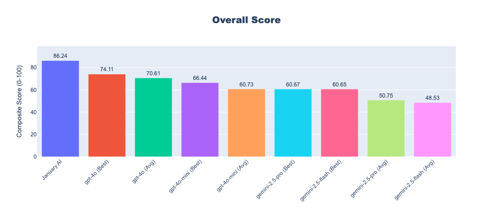
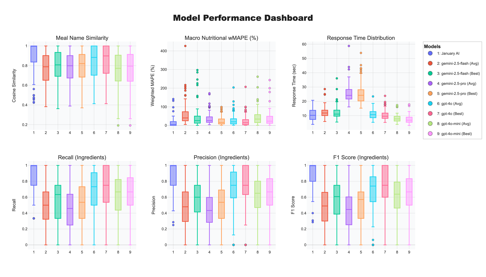

# Food-Scan Benchmarks

An open-source benchmark demonstrating January AI's state-of-the-art performance in food image analysis against leading models like GPT-4o and Gemini 2.5.

---

## Overview

Accurately identifying foods and their nutritional content from an image is a complex task that general-purpose vision models struggle with. To push the state-of-the-art forward, we developed Food-Scan Benchmarks, a standardized evaluation framework for this unique challenge.

This project runs a diverse set of real-world food images through specialized and general-purpose Vision-Language Models (VLMs) to score their performance.

### The Benchmark Dataset
This benchmark is evaluated on a dataset of 1,000 real-world food images collected using the January AI app representing a wide variety of everyday meals, diverse cuisines, challenging lighting conditions, and realistic camera angles—conditions that typical academic datasets often lack. We took extra measures to ensure data quality and user privacy. 

### Key Metrics
The benchmark evaluates models on the following criteria:

- 🏷️ **Meal Name Similarity**: How semantically close the predicted meal name is to the ground truth, measured by cosine similarity of text embeddings. (Higher is better)
- 🥬 **Ingredient Recognition**: The model's ability to correctly identify ingredients, measured by Precision, Recall, and F1 Score. (Higher is better)
- 📊 **Macro-nutrient Estimation**: The accuracy of predicted calories, carbohydrates, protein, and fat, measured by Weighted Mean Absolute Percentage Error (wMAPE). (Lower is better)
- ⏱️ **Response Time**: The wall-clock time in seconds for the model to return an analysis. (Lower is better)
- 🎯 **Overall Score**: A unified score (0-100) combining all of the above metrics into a single, comprehensive performance indicator. (Higher is better)

The results are clear: **January AI's specialized vision model significantly and consistently outperforms general-purpose flagship models** from OpenAI and Google across the most important accuracy-based metrics.

## Leaderboard



The Overall Score is a composite metric (0-100) that unifies all performance benchmarks into a single number to represent a model's overall capability on this task. January AI achieves the highest overall score by a significant margin, establishing a new state-of-the-art for automated food analysis.

| Rank | Model | Overall Score
| -------- | ------- | ------- |
| 1 🥇   | `january-ai-vision` | 86.24
| 2 🥈  | `gpt-4o`            | 74.11
| 3 🥉  | `gpt-4o-mini`       | 66.44
| 4    | `gemini-2.5-pro`    | 60.67
| 5    | `gemini-2.5-flash`  | 60.65

*Last updated: June 2025*

The dashboard below shows a detailed breakdown of each model's performance distribution across core metrics.



#### 1. Meal & Ingredient Recognition: Unmatched Accuracy
- **Meal Name Similarity**: January AI demonstrates the highest median cosine similarity, meaning it consistently generates the most semantically accurate meal names.
- **Ingredient Recognition (`F1 Score`, `Precision`, `Recall`)**: For the critical task of identifying all ingredients, January AI leads across the board. It achieves the best balance of Precision (not hallucinating ingredients) and Recall (not missing ingredients), resulting in the highest F1 Score.

#### 2. Nutritional Accuracy: Lowest Error Rate
- **Macro Nutritional wMAPE (%)**: This metric measures the weighted mean absolute percentage error for macros (calories, protein, fat, carbs), where lower is better. January AI exhibits one of the lowest error rates, proving its superior capabilities in quantitative nutritional estimation compared to even flagship models like GPT-4o and Gemini 2.5 Pro.

#### 3. The Speed vs. Accuracy Trade-off
- **Response Time (sec)**: While lightweight models like gemini-2.5-flash offer the fastest response times, this speed comes at a significant cost to accuracy. January AI operates in a "sweet spot," delivering response times competitive with flagship models while providing vastly superior analytical quality.


## Quick start

Requirements

- Python 3.12+
- `uv` (or `pipx install uv`)

```bash
# 1 . clone
git clone https://github.com/January-ai/food-scan-benchmarks.git
cd food-scan-benchmarks

# 2 . install
uv sync

# 3 . set credentials
cp .env.example .env  # then edit with your API keys

# 4 . run benchmark
python -m food_scan_bench.run_benchmark --models january/food-vision-v1 gpt-4o
```

The first run downloads the dataset from S3 and caches it locally.

## CLI usage

```bash
python -m food_scan_bench.run_benchmark [OPTIONS]

Options
  --models TEXT...          Models to evaluate (default: all)
  --max-items INTEGER       Number of images to process (default: 20)
  --visualize / --no-visualize  Create Plotly HTML dashboards (on by default)
  --baseline-model TEXT     Model used for win/loss comparison plots
  --export-report           Write detailed CSV report to disk
  --help                    Show full help
```

Example: cost-effectiveness analysis for small, cheap models

```bash
python -m food_scan_bench.run_benchmark \
    --models gpt-4o-mini gemini/gemini-2.5-flash-preview-05-20 \
    --max-items 50
```

## Supported models

| Provider   | Identifier                                        |
| ---------- | ------------------------------------------------- |
| January AI | `january/food-vision-v1`                          |
| OpenAI     | `gpt-4o`, `gpt-4o-mini`                           |
| Google     | `gemini/gemini-2.5-flash-preview-05-20`           |
|            | `gemini/gemini-2.5-pro-preview-06-05`             |
| Other      | Any LiteLLM-compatible model that supports images |

Add your own model in a few lines—see below.

## Project layout

```text
food_scan_bench/
├── run_benchmark.py     # CLI entry-point
├── models/              # API wrappers (January, LiteLLM, …)
├── evaluate.py          # Async evaluation pipeline
├── metrics.py           # Scoring functions
├── analyze_results.py   # Plots & stats
└── dataset/             # Dataset download / cache helpers
```

## Adding a new model

1. Create a wrapper in `food_scan_bench/models/` that implements `analyse(self, image: PIL.Image) -> FoodAnalysis`.
2. Register the model id in `food_scan_bench/run_benchmark.py`.
3. `FoodAnalysis` must include the meal name, ingredients list, and macro nutrients.

## Contributing & license

Bug reports, feature requests and PRs are welcome! Please:

1. Fork → feature branch → write tests.
2. Ensure `pre-commit run --all-files` pass (see `.pre-commit-config.yaml`).
3. Open a pull request.

Licensed under the MIT License (see [LICENSE](LICENSE)).

---

© January AI. For commercial or research use of the January AI Food Vision model, please contact [January AI](https://january.ai).
